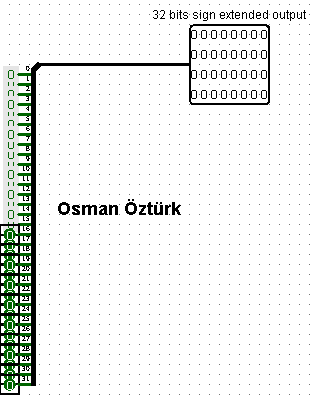
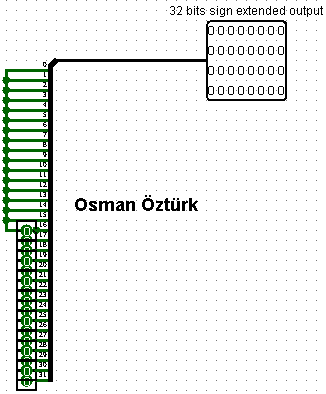
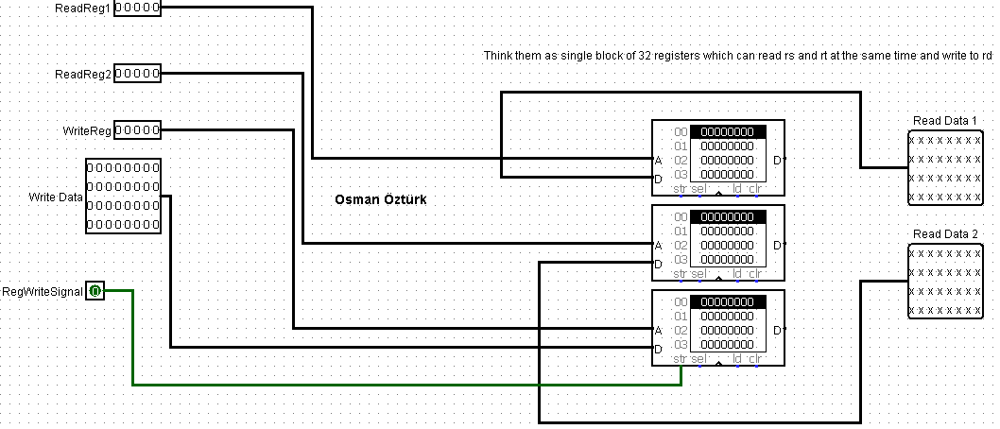
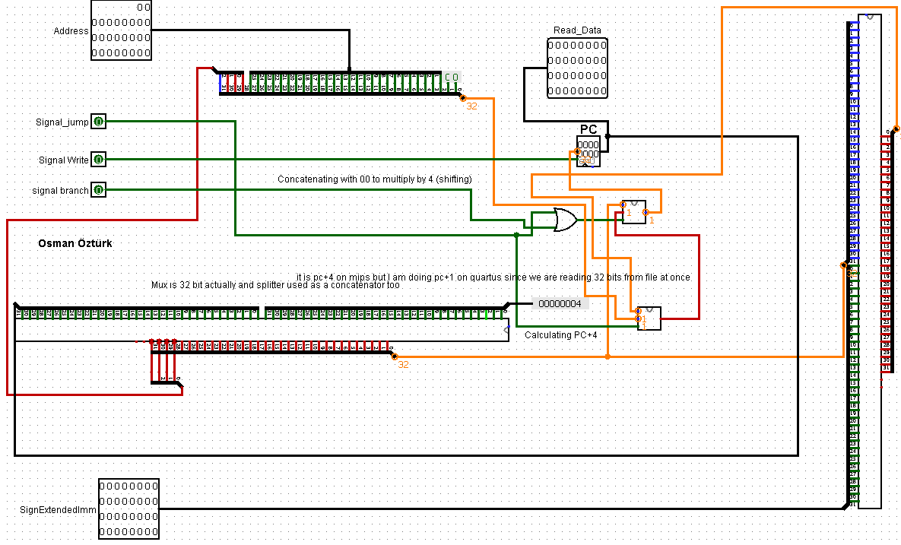
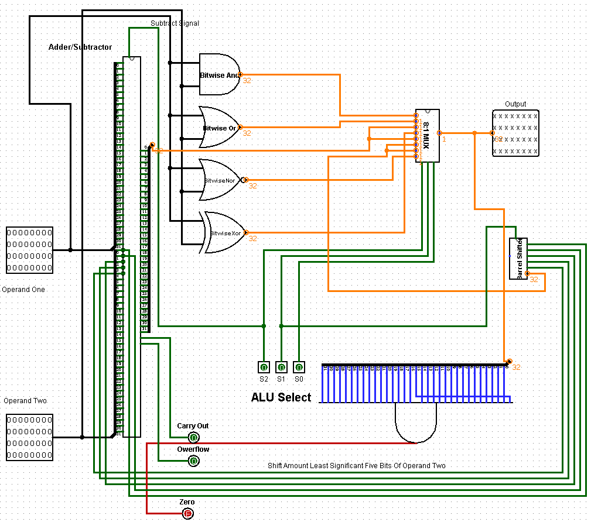
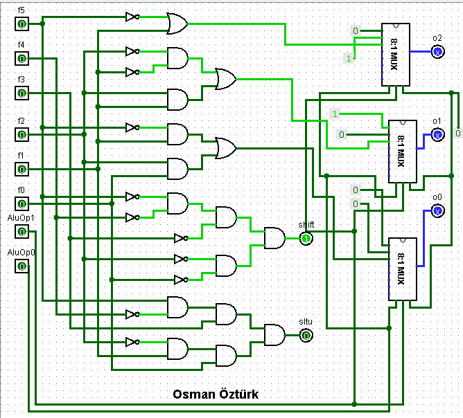
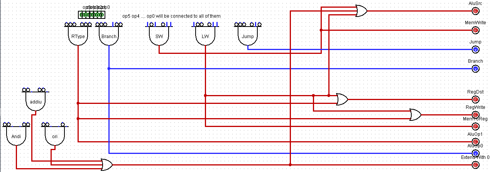
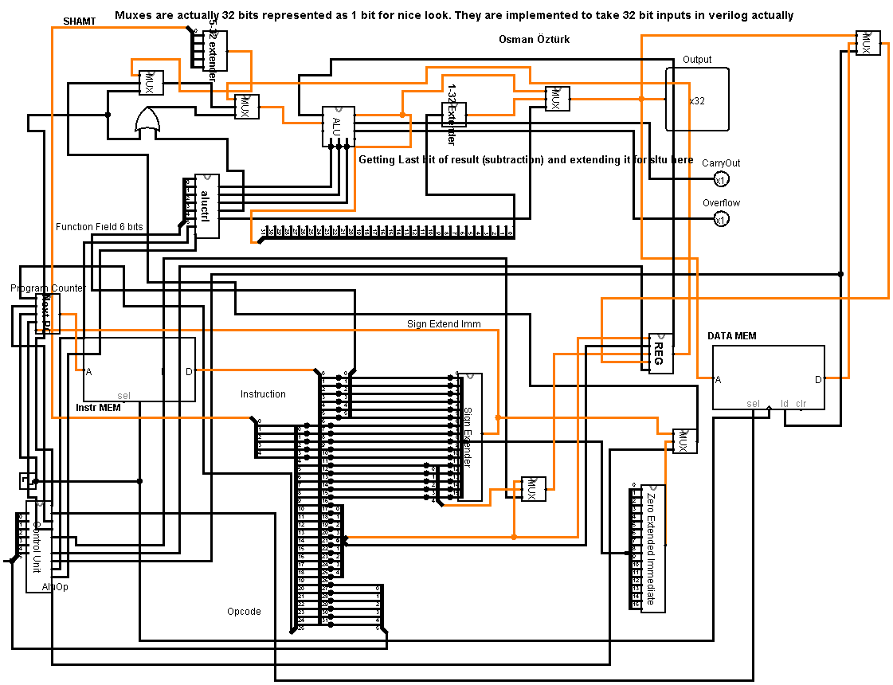
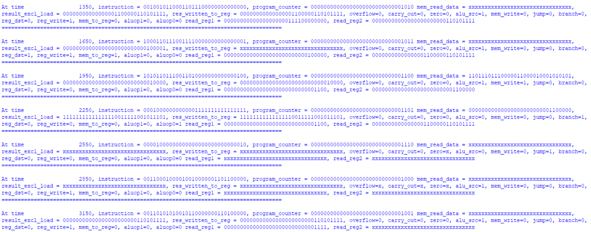

# MIPS32-Behavioral
MIPS Architecture based fully functional 32 bits CPU design in behavioral verilog

I have designed all of my circuits using Logisim. I have represented 32 bit inputs as 1 bit input sometimes for more clear view they are actually designed to operate with 32 data bits. And I have used splitter wire in reverse for transferring 32 bits from one wire. 
We are using 32 bits for addressing in mips  but I have implemented data memory and instruction memory with 256 lines with each containing 32 bits. So  not all of the address input serves a purpose. Since I have read 32 bits at a time my program counter increases by 1 in each cycle rather than 4.
.mem files  come within quartus qar file inside of the workspace folder since quartus uses that folder. registers.mem instructions.mem program_counter.mem and data.mem must be placed inside of the simulation/modelsim folder before simulating in modelsim. I have added them to the folder seperately too. 
I have changed my alu to generate zero flag and take aluop1 and aluop0 as inputs which comes from the real control unit.
I have designed two 16 to 32 bit extenders (zero extender and sign extender) for supporting I type instructions, I have also designed two to one muxes with different bit lengths but they are the same as usual. All other modules’ designs are the same with previous version.
Designs:
 
   
Zero and Signed Bit Extenders
Mips registers, next_pc, instruction memory and data memory modules are designed using behavioral Verilog since they contain memory. But I have designed mips registers and next_pc modules’ interior in Logisim too for a brief understanding in structure. Register module is designed as a single block of registers in original but I have showed them with three different memory modules in Logisim. They are not actually designed like that. 

Mips Registers Module for showing brief structure understanding

PC increases by 1 in actual design rather than 4. Since I read a single 32 bit line at once.
Next PC Module for showing brief structure understanding.
Assumed that instruction and data memory contains 256 lines of 32 bits data. I have created necessary instructions by hand for testing and repeated them inside of the instructions.mem file and data.mem file which contains random data.

ALU has zero flag now for performing branch equal operation. Result should be zero for branching and branch signal should be 1. Jump operation is different and will be performed regardless of the alu result. It only depends on the jump signal.

Alu control now takes aluop1 and aluop0 as inputs to differentiate from R type and other instructions. It had to behave as the same on R Type instructions and had to give different outputs for other types. I have achieved that by using muxes. Muxes select according to aluop bits and they give the R type output as designed before if necessary. I have shorted unused mux inputs to ground in design. Using these muxes alucontrol now performs subtraction on beq for example. That is achieved by aluop output from control unit.

Control Unit
Control unit creates the necessary outputs for muxes and memory elements in the datapath according to instruction’s opcode. It also outputs aluop signals for alu control unit . Alu control unit uses these and function field of the instruction to determine the operation it should perform. It is very smillar to mips single cycle datapath’s control unit showed in the lecture except jump and extend with zero signals. (used for extending Immediate field with zeroes instead of sign extending it.) It also doesn’t have memread signal. Memory is considered as readable at all times in my design.

Output: 

It shows X’s for don’t care situations. Other values doesn’t matter if jump is performed for example. Clock doesn’t stop by itself in test bench. Simulation break should be used.
